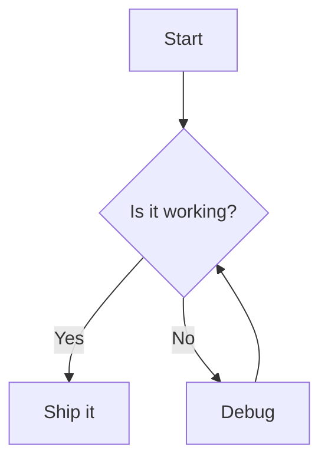

# Mattermost Mermaid Plugin

Renders [Mermaid](https://mermaid.js.org/) diagrams inline within Mattermost posts.

Write a fenced code block using the `mermaid` language and the plugin replaces it with the rendered diagram:

````markdown

````

## How it works

This is a web app-only plugin. On the client it registers a root component that watches the DOM for rendered code blocks and, for any block whose contents start with a recognized Mermaid diagram keyword, lazily loads the Mermaid library and renders the diagram in place of the source.

- **Theme aware** — diagrams follow the active Mattermost theme (light/dark) and re-render when the theme changes.
- **Lazy loaded** — the Mermaid library is code-split and only fetched the first time a diagram is encountered, so it adds no cost for users who never view one.
- **Live updates** — edited posts re-render, and invalid diagrams fall back to showing the original source alongside an error message.

## Supported diagrams

All diagram types supported by Mermaid, including flowcharts, sequence diagrams, class diagrams, state diagrams, entity relationship diagrams, Gantt charts, pie charts, git graphs, mindmaps, and more.

## Development

Build the plugin:

```bash
make dist
```

This produces a bundle at `dist/com.mattermost.mermaid-<version>.tar.gz` that can be uploaded from **System Console → Plugin Management**.

Deploy directly to a local server (requires plugin uploads to be enabled):

```bash
export MM_SERVICESETTINGS_SITEURL=http://localhost:8065
export MM_ADMIN_TOKEN=<token>
make deploy
```

Watch for webapp changes and redeploy automatically:

```bash
export MM_SERVICESETTINGS_SITEURL=http://localhost:8065
export MM_ADMIN_TOKEN=<token>
make watch
```

### Releasing new versions

The version of the plugin is determined at compile time from git tags. See `make patch`, `make minor`, and `make major`.
